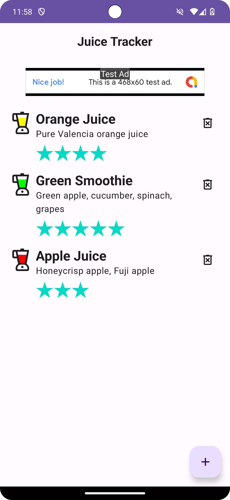

Juice Tracker app
==================================

This app lets you keep track of notable juices by building a list consisting of detailed items.

It's developed using Jetpack Compose components like ```ConstraintLayout```, ```Button```, ```Text```, ```EditText```, and ```Guideline```.

<p align="center">
  
</p>

Getting Started
---------------

1. [Install Android Studio](https://developer.android.com/studio/install.html), if you don't already
   have it.
2. Download the app.
3. Import the app into Android Studio.
4. Build and run the app.
